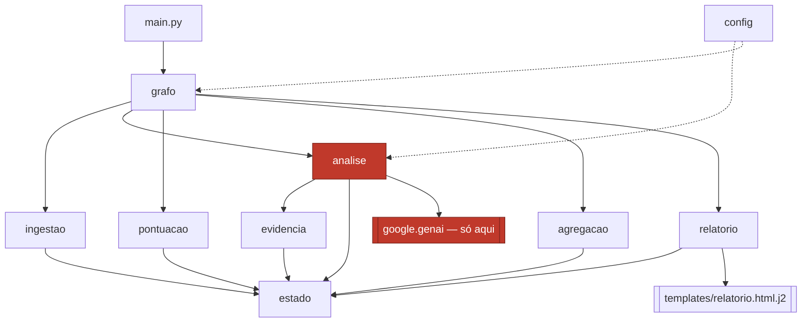
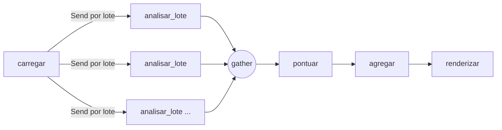

# Architecture Spine — Plataforma de Análise de Reclamações

## Design Paradigm

**Pipes-and-filters sobre estado compartilhado explícito, com exatamente um filtro impuro.**

Cada etapa é uma função do estado para um delta do estado. O grafo do LangGraph aplica os deltas; nenhuma etapa muta o estado que recebeu. Um único filtro — `analisar_lote` — tem permissão de tocar a rede. Todos os outros são determinísticos e executáveis sem credencial.

O mapeamento é direto: um módulo por filtro, o estado em um módulo próprio que nenhum filtro importa de outro filtro.

## Invariants & Rules

### AD-1 — Sinal é par indivisível, não duas listas paralelas

- **Binds:** contrato de estado, `analise`, `evidencia`, `pontuacao`, CAP-4, CAP-5
- **Prevents:** citação órfã de sinal, e índice entre listas saindo de sincronia — a mesma classe de falha que o casamento por `id` elimina em CAP-1
- **Rule:** `Sinal = {codigo, citacao, valida}`. `sinal_b: list[str]`, `evidencia: list[str]` e `sinal_a: bool` não existem — ameaça explícita é um código do catálogo como qualquer outro, e mantê-la como booleano à parte a deixava fora da regra da evidência, no único campo que a base nunca exercita. Nenhum caminho de código produz um código de sinal sem a citação que o sustenta. A citação tem piso de cinco palavras (FR-6), verificado no mesmo lugar que a verificação de substring — se o piso viver só no prompt, M-2 é inverificável.

### AD-2 — Citação inválida derruba o código inteiro

- **Binds:** `evidencia`, `pontuacao`, FR-7, CAP-5
- **Prevents:** um sinal sobreviver pela citação boa depois que o modelo já demonstrou fabricar na citação ruim
- **Rule:** se qualquer `Sinal` de um dado `codigo` falha na verificação de substring ou no piso de cinco palavras, aquele `codigo` é ausente para efeito de pontuação — inclusive os pares do mesmo código que passaram. A contagem que FR-2 e CM-2 reportam é de **códigos derrubados**, não de pares reprovados nem de reclamações afetadas; as três são defensáveis e só uma pode ser a métrica.

### AD-3 — Proveniência é primeira classe

- **Binds:** `pontuacao`, `relatorio`, FR-9, FR-12
- **Prevents:** inventar citação para o valor de uma coluna do CSV, que é exatamente a fabricação que AD-2 existe para pegar
- **Rule:** `Motivo.origem ∈ {sinal, atributo}`. `origem == "sinal"` exige `citacao` não nula e vem do modelo; `origem == "atributo"` tem `citacao` nula e vem de coluna do CSV. Nenhuma etapa converte uma origem na outra.

### AD-4 — Quem pontua carrega o motivo; quem renderiza não o reconstrói

- **Binds:** `pontuacao`, `relatorio`, FR-12
- **Prevents:** o renderizador consultar `Reclamacao` para descobrir por que um item está na fila, duplicando a regra de pontuação num segundo lugar onde ela sai de sincronia
- **Rule:** `Pontuacao = {id, pontos, na_fila, motivos}`. O nó `renderizar` lê `reclamacoes` para **exibir** — empresa, título, data, sem os quais a fila é uma lista de identificadores e a UJ-2 não acontece — e `falhas` para cumprir FR-14 e NFR-6, sem o que ele não tem como saber que a execução foi degradada. O que ele nunca faz é **derivar** por que um item está ali. A linha é: nenhuma condicional do template consulta `Reclamacao`. Se a resposta a *por que este item está na fila* não estiver em `motivos`, ela não é renderizável.

### AD-5 — Falha é registro próprio e carrega os ids afetados

- **Binds:** `analise`, `agregacao`, `relatorio`, FR-2, FR-14, NFR-5, NFR-6
- **Prevents:** um relatório sobre 5 de 50 reclamações reportar "1 falha" e ter aparência de execução limpa
- **Rule:** `Falha = {ids, causa, no}`, acumulada com o redutor `add`. Uma execução de lote esgotada produz **uma** `Falha` com os ids daquele lote. FR-2 reporta dois números — eventos e reclamações afetadas — e o denominador de NFR-6 é o segundo.

### AD-6 — Conservação de reclamações

- **Binds:** todos os nós após `analisar_lote`
- **Prevents:** uma reclamação evaporando entre lotes ser indistinguível de uma que nunca entrou
- **Rule:** `len(reclamacoes) == len(analises) + sum(len(f["ids"]) for f in falhas)`, verificado em asserção após o gather e antes de `pontuar`.

### AD-7 — Um único filtro impuro `[ADOPTED]`

- **Binds:** todos os nós, CAP-9
- **Prevents:** lógica de julgamento acoplada à rede, tornando nominal a separação "o modelo extrai, o código julga"
- **Rule:** apenas `analise.py` importa `google.genai`, direta ou transitivamente. O cliente é construído **dentro** de `analisar_lote`, nunca em escopo de módulo — cliente em escopo de módulo faz `import analise` exigir credencial, e nenhum teste de AD-16 ou NFR-7 poderia ser escrito sem rede, quebrando AD-12. Verificável por inspeção de import.

### AD-8 — O lote é uma execução de nó, não uma iteração dentro de um nó

- **Binds:** `grafo`, `analise`, contrato de estado, NFR-3
- **Prevents:** retry no nível do nó re-executar todos os lotes e gastar token nos que já haviam voltado corretos
- **Rule:** `carregar` emite um `Send` por lote para `analisar_lote`. `analises` e `falhas` são acumuladas pelo redutor `add`; nenhum lote lê o resultado de outro.

### AD-9 — Repetição é política do nó, não código no nó

- **Binds:** `grafo`, `analise`, NFR-4
- **Prevents:** backoff reimplementado à mão divergindo do que o framework já garante, e a reanálise por desenho que NFR-4 proíbe se confundindo com repetição por transporte
- **Rule:** `retry_policy=` no `add_node` de `analisar_lote` cobre falha de transporte; o código do nó não tem laço de repetição. **`error_handler=` no mesmo `add_node` é obrigatório** e é quem produz a `Falha` de AD-5 — sem ele, retry esgotado propaga a exceção e aborta o grafo inteiro, e AD-5, AD-6, AD-13, FR-2 e NFR-6 ficam sem caminho de execução. O teto de custo do fan-out é o número de lotes (AD-17), não a concorrência: `max_concurrency` só é honrado pelo executor assíncrono, e o v1 invoca de forma síncrona.

### AD-10 — O relatório é template com dados injetados

- **Binds:** `relatorio`, FR-9 a FR-17
- **Prevents:** f-string aninhada para laço de fila sobre laço de motivos sobre condicional de degradado; e escape de HTML esquecido num campo que carrega texto livre de consumidor
- **Rule:** um único `Environment` do Jinja2, construído em `relatorio.py`, com `autoescape=True` — literal, não `select_autoescape`. O seletor casa por extensão e `relatorio.html.j2` termina em `.j2`, caindo no `default=False`: escreveria a linha que parece a defesa e deixaria o autoescape desligado. Há um único template; o booleano é correto e é verificável por leitura. Nenhum segundo `Environment` em nenhum módulo. Texto de produto (FR-13, FR-16) vive no template, não em Python.

### AD-11 — Autocontenção do artefato entregue

- **Binds:** `relatorio`, template, FR-10, FR-15, NFR-9
- **Prevents:** FR-10 quebrar em silêncio quando alguém adicionar uma fonte remota e testar com a internet ligada
- **Rule:** todo byte que o navegador renderiza já estava no arquivo quando ele foi escrito. Fonte, CSS, ícone e gráfico são inline. Gráficos são `<svg>` escrito no template; nenhuma biblioteca de plotagem, nenhum `<script src>`, nenhum `<link href>` externo.

### AD-12 — Tudo que o modelo não decide é testável sem o modelo

- **Binds:** `evidencia`, `pontuacao`, `agregacao`, `relatorio`, Q-4, CM-2
- **Prevents:** a suíte inteira depender de credencial, o que reacopla julgar a extrair mesmo com os nós separados
- **Rule:** verificar, pontuar, agregar e renderizar são funções puras sobre estruturas do estado, alimentadas por `Analise` fabricada à mão. Nenhum teste faz chamada de rede. As três parcelas que a base não exercita (ameaça explícita, dano continuado, registro contraditório) e a verificação de citação falsa têm caso construído à mão — a suíte é a única coisa que as executa.

### AD-13 — Relatório sobre nada não é relatório

- **Binds:** `grafo`, `agregacao`, `relatorio`, §6 do PRD
- **Prevents:** API fora do ar produzir 50 falhas, satisfazer AD-6 com `50 == 0 + 50`, e a execução seguir feliz até escrever um HTML sobre zero análises — que é o "relatório parcial silencioso" que o PRD proíbe em letra
- **Rule:** se `len(analises) == 0`, a execução encerra com a causa nomeada e **não escreve arquivo**, independentemente de AD-5 ter classificado as falhas como conteúdo. A mesma porta cobre CSV vazio: nenhuma reclamação lida encerra em `carregar`, antes do fan-out.
  Segunda condição, que o contador de análises não pega: se o modelo propôs ao menos um sinal e **100% deles foram derrubados** por AD-2, o relatório é marcado degradado. Cinquenta análises com todas as citações fabricadas produzem `len(analises) == 50`, zero falhas, NFR-6 lendo 0% — e um relatório de aparência impecável sobre um modelo quebrado. A taxa de derrubada é o único sinal que enxerga esse estado.

### AD-14 — Leitura não validada não se apresenta como validada

- **Binds:** `relatorio`, template, §1 e M-5 do PRD
- **Prevents:** o relatório dar à distribuição de sentimento e ao ranking de produtos a mesma autoridade visual que dá à fila, quando a §1 do PRD registra que esta base não exercita nenhuma das duas
- **Rule:** distribuição de sentimento e ranking de produtos carregam, no próprio relatório, a ressalva do que os limita nesta base — sentimento constante e produto genérico. A ressalva é texto do template, ao lado do gráfico, não nota de rodapé. Mesmo tratamento estrutural de FR-16.

### AD-15 — A saída nasce ignorada pelo versionamento

- **Binds:** `relatorio`, `main`, DG-2, DG-3
- **Prevents:** um relatório produzido sobre base real entrar no repositório público — o `.gitignore` ignora `relatorio*.html`, e um arquivo nomeado pelo CSV de entrada não casa com esse glob
- **Rule:** o nome do arquivo de saída começa sempre com `relatorio-`. O nome do CSV de entrada e a data vêm depois do prefixo, nunca antes.

### AD-16 — A empresa não atravessa a fronteira do modelo

- **Binds:** `analise`, prompt, CAP-3
- **Prevents:** o ranking de produtos ser derivado do nome da empresa — na base do projeto empresa e reclamação estão pareadas ao acaso, e um supermercado com reclamação de voo cancelado produz ranking falso. E, mais grave, o **título** entregar a resposta: `baseline.py` classifica por match exato de `Titulo`, então mandar o título ao modelo faz o LLM reproduzir a linha de base e esvazia M-1
- **Rule:** o payload enviado ao modelo carrega **`id` e `texto`, nada mais**. `empresa` e `titulo` ficam fora por construção, não por instrução no prompt — o que não é enviado não pode ser inferido. Isto ratifica o que `classificador.py` já faz e documenta.

### AD-17 — O tamanho de lote é validado, não apenas configurável

- **Binds:** `config`, `grafo`, NFR-2
- **Prevents:** duas proibições explícitas do SPEC — chamada individual por reclamação, e base inteira num único prompt — virarem alcançáveis por variável de ambiente sem validação
- **Rule:** `tamanho_lote` tem piso 2 e teto 25, verificados na carga da configuração. A validação recai sobre **os lotes emitidos**, não sobre a variável: `tamanho_lote = 7` em 50 linhas deixa um último lote de 1 — a chamada individual que este AD existe para impedir. Um lote residual de tamanho 1 é fundido ao anterior. Fora da faixa, a execução encerra antes de qualquer chamada paga. Quem fatia é `carregar`, no mesmo lugar que emite os `Send`.

### AD-18 — O glossário do catálogo é artefato versionado, não literal no prompt

- **Binds:** `analise`, `evidencia`, `pontuacao`, CAP-4
- **Prevents:** o catálogo de sinais divergir entre o texto do prompt, a lógica de pontuação e a suíte de testes — `risk-signals.md` registra que a definição escrita com exemplo dentro do prompt é o **maior fator isolado de acurácia**
- **Rule:** os códigos do catálogo e suas definições vivem em um único módulo, importado pelo construtor do prompt e pela pontuação. Nenhum código de sinal aparece como literal solto em `analise.py`, `pontuacao.py` ou no template.

### AD-19 — Um escritor por chave de estado

- **Binds:** todos os nós
- **Prevents:** dois donos da mesma decisão — `na_fila` pode ser lido como propriedade de `Pontuacao` (dono: `pontuar`) ou como resultado da ordenação da fila (dono: `agregar`); com os dois escrevendo, a fila renderiza vazia sem erro nenhum e M-1 mede o campo errado
- **Rule:** cada chave de `Estado` tem exatamente um nó que a escreve. `pontuacoes` é de `pontuar` — inclusive `na_fila` e o corte. `agregados` é de `agregar`, que **ordena e conta, nunca decide pertencimento**. `analises` e `falhas` são do fan-out. Nenhuma chave sem redutor recebe escrita de mais de um nó.

### AD-20 — Toda fronteira do estado é tipada

- **Binds:** contrato de estado, `agregacao`, `relatorio`
- **Prevents:** `agregados: dict` ser a única fronteira sem forma declarada, com `agregar` e o template divergindo sobre as chaves e o erro só aparecendo como campo vazio no navegador do gestor
- **Rule:** `Agregados` é `TypedDict`, não `dict`. `Sinal.valida` é `bool` com default `False`, não `bool | None` — um sinal não verificado é indistinguível de um sinal reprovado para efeito de pontuação, e o terceiro estado só cria caminho para esquecer de rodar a verificação.

### AD-21 — O modelo devolve produto cru; o código decide o que é genérico

- **Binds:** `analise`, `agregacao`, `catalogo`, CM-3, AD-14
- **Prevents:** resolver "produto genérico" dentro do prompt — devolvendo `null` para `fatura` ou `compra` — o que obedece todos os outros ADs, destrói o insumo de CM-3 de forma irreversível e torna AD-14 insatisfazível, porque não sobra genérico algum no estado para a ressalva nomear
- **Rule:** o modelo devolve o produto como leu, sem julgamento. A lista de termos genéricos vive em `catalogo.py` ao lado do catálogo de sinais, e `agregar` a aplica. `produto = None` significa apenas *o texto não permitiu identificar*, nunca *identifiquei algo vago*.

### AD-22 — Toda contagem que o PRD reporta tem campo no estado

- **Binds:** `agregacao`, `relatorio`, FR-2, FR-14, NFR-6, CM-2, CM-3
- **Prevents:** a taxa de degradação de NFR-6 e o contador de derrubadas de CM-2 serem calculados dentro do template, que é justamente onde AD-4 proíbe que se decida qualquer coisa
- **Rule:** `Agregados` carrega os números que FR-2, FR-14, NFR-6, CM-2 e CM-3 reportam, calculados em `agregar`. O template exibe; não soma, não divide, não compara com limiar.

### Direção de dependência



Nenhum filtro importa outro filtro, com uma exceção declarada: `analise` importa `evidencia`, porque a verificação roda sobre a resposta do modelo antes de o delta entrar no estado. `estado` não importa ninguém.

## Consistency Conventions

| Concern | Convention |
| --- | --- |
| Nomeação | Módulos e funções em português, como o domínio e o resto do repositório. Nós do grafo nomeados pelo verbo da etapa: `carregar`, `analisar_lote`, `pontuar`, `agregar`, `renderizar` |
| Identificador | `ID_Reclamacao` da origem, validado único na ingestão. Casamento sempre por `id`, nunca por posição — inclusive para detectar id que o modelo devolveu sem ter sido pedido |
| Datas | ISO-8601 no estado; `DD/MM/AAAA` só na fronteira de leitura do CSV |
| Leitura do CSV | `utf-8-sig` e separador `;`. Ler com `utf-8` cru cola um BOM no nome da primeira coluna |
| Erro | Falha de conteúdo vira `Falha` no estado e a execução segue. Falha de infraestrutura encerra sem escrever relatório, informando o que havia concluído |
| Configuração | Variável de ambiente com default no código, via `python-dotenv`. Um mecanismo, não dois — a chave da API já chega assim |
| Credencial | Somente de variável de ambiente. Nunca em código, template, teste ou repositório |
| Saída do modelo | `response_schema` do `google-genai`, não parsing de texto livre. O schema deriva de `Analise` e `Sinal`; resposta que não casa com o schema é falha de conteúdo (AD-5), não exceção |
| Pesos e corte | Vêm de `risk-signals.md`, que é a fonte. `pontuacao.py` os declara em um lugar só, com o código do catálogo como chave — nunca literal espalhado |
| Observabilidade | A saída do operador (FR-2) é a observabilidade do sistema. Não há log estruturado, métrica exportada nem trace: o que não aparece na tela do operador ao encerrar não existe |

## Stack

| Name | Version |
| --- | --- |
| Python | ≥3.11 |
| langgraph | 1.2.10 |
| google-genai | ≥2.17.0 |
| Modelo | `gemini-3.6-flash` |
| jinja2 | 3.1.6 |
| python-dotenv | ≥1.2.2 |
| pytest | 9.1.1 |

## Structural Seed



```text
plataforma/
  estado.py       # Reclamacao · Sinal · Analise · Falha · Motivo · Pontuacao · Estado
  catalogo.py     # códigos de sinal e suas definições — fonte única do prompt e da pontuação
  ingestao.py     # nó carregar — valida schema e unicidade antes de qualquer chamada paga
  analise.py      # nó analisar_lote — único módulo que importa o SDK do modelo
  evidencia.py    # verificação de citação — determinística, sem rede
  pontuacao.py    # nó pontuar — parcelas, modificador de Status, motivos
  agregacao.py    # nó agregar — ranking, distribuição, ordenação da fila
  relatorio.py    # nó renderizar — o Environment único do Jinja2
  templates/
    relatorio.html.j2
  grafo.py        # StateGraph · Send · RetryPolicy · compile
  config.py       # lote, concorrência, modelo — de env com default
main.py           # CLI: caminho do CSV e flag de sobrescrita
tests/
baseline.py       # medição, preexistente
classificador.py  # medição, preexistente
pyproject.toml    # dependências e faixa de Python
.env.example      # nomes das variáveis, nunca valores — NFR-10
.gitignore        # cobre relatorio-*.html — AD-15 depende deste glob
README.md         # declara o corpus sintético — DG-5
```

## Capability → Architecture Map

| Capability | Lives in | Governed by |
| --- | --- | --- |
| CAP-1 Ingestão | `ingestao.py` | Convenções de identificador e leitura do CSV |
| CAP-2 Sentimento | `analise.py` | AD-7 |
| CAP-3 Produto | `analise.py` | AD-7, **AD-16** |
| CAP-4 Sinais de risco | `analise.py` + `catalogo.py` | AD-1, AD-7, **AD-18** |
| CAP-5 Verificação de evidência | `evidencia.py` | AD-1, AD-2, AD-12 |
| CAP-6 Priorização | `pontuacao.py` | AD-3, AD-4, AD-12, AD-18 |
| CAP-7 Agregação | `agregacao.py` | AD-5, AD-6, AD-12 |
| CAP-8 Relatório | `relatorio.py` + template | AD-4, AD-10, AD-11, AD-13, AD-14, AD-15 |
| CAP-9 Orquestração | `grafo.py` | AD-7, AD-8, AD-9, AD-17, paradigma |

## Deferred

- **Cache, cascata entre modelos, guard-rails, loop de crítica, checkpoint persistido.** Todos em `roadmap.md`. AD-1, AD-5 e AD-8 os mantêm aditivos **no eixo da identidade** — cada um precisa saber de qual reclamação está falando, e o `id` atravessa o estado inteiro. Isso não é o mesmo que dizer que todos entram sem tocar no contrato, e a distinção importa:
  - **Checkpoint e guard-rails:** aditivos de fato.
  - **Cache:** exige uma versão do prompt no estado, que hoje não existe em lugar nenhum. Chave de cache sem ela serve resposta velha para prompt novo.
  - **Cascata:** meio aditiva. `Sinal.valida` é booleano e não comporta *dois modelos concordaram*.
  - **Loop de crítica:** não aditivo. Exige um terceiro balde além de `analises` e `falhas`, o que altera a identidade de AD-6 e a semântica de `Falha` que FR-2 e NFR-6 consomem.
  - **Níveis de criticidade na fila:** não aditivo. `na_fila` é booleano e está preso em `agregacao` e no template.
- **Roteamento condicional e sublote de escalada.** O fan-out de AD-8 já é a estrutura sobre a qual isso entra; o v1 não tem roteador.
- **Concorrência maior que 1.** Depende da Q-8 do PRD — cronometrar NFR-1 com o cache desligado. Botão já exposto por AD-9.
- **Envelope operacional — parcialmente adiado, e a distinção importa.** *Adiado de verdade:* deploy, ambientes, provisionamento, CI. A execução é manual, local, iniciada pelo operador, e a saída é um arquivo — esta altitude não possui essa dimensão. *Decidido, não adiado:* observabilidade é a saída do operador (ver convenções), comportamento de saída é AD-13 e AD-15, e os arquivos de contorno que três regras pressupõem — `.gitignore`, `.env.example`, `README.md`, `pyproject.toml` — estão no seed estrutural porque AD-15, AD-17 e NFR-10 dependem deles existirem.
- **Persistência entre execuções.** Cada rodada é independente por decisão do PRD; nada compara com o relatório anterior.
