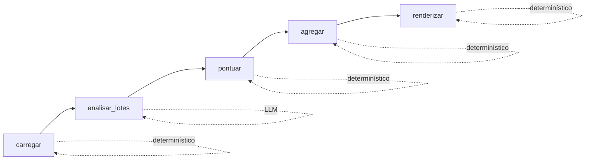
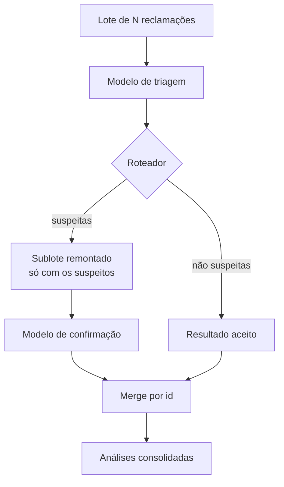
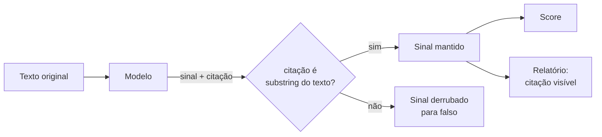

# Diagramas de arquitetura

Companion de `SPEC.md`. Sustenta CAP-9.

## Grafo do v1

Divisão dos nós **por etapa do fluxo**. Linear; o roteamento condicional entra junto com a cascata, em `roadmap.md`.

| Nó | Tipo | Responsabilidade |
|---|---|---|
| `carregar` | determinístico | Lê o CSV, valida o schema fixo, atribui `id` estável. Falha explicitamente em coluna faltando. |
| `analisar_lotes` | **LLM** | Único nó que chama o modelo. Fatia em lotes, saída estruturada, casa resposta por `id`. |
| `pontuar` | determinístico | Aplica as três parcelas e a aritmética de prazo. Nenhuma chamada de rede. |
| `agregar` | determinístico | Contagens, ranking de produtos, distribuição de sentimento, ordenação da fila. |
| `renderizar` | determinístico | Escreve o arquivo HTML único. |

## Lote e escalada

O conflito estrutural: lote quer atomicidade, cascata quer granularidade. A resolução é o lote se desfazer na escalada — nunca chamada individual.

**No v1 apenas o caminho superior existe** — um único modelo, sem roteador e sem sublote. O diagrama registra o desenho alvo para que o contrato de estado seja construído compatível com ele desde a primeira versão.

O merge final é sempre **por `id`**. É por isso que o identificador estável é o item não-aditivo do contrato.

## Fluxo da evidência

A verificação é determinística e roda depois de toda resposta do modelo. É a implementação de CAP-5 e a defesa primária contra falso positivo.
